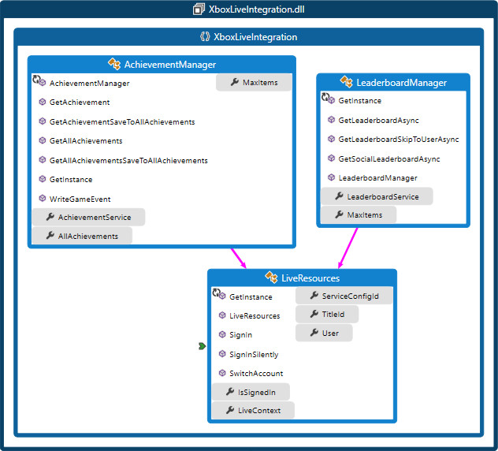
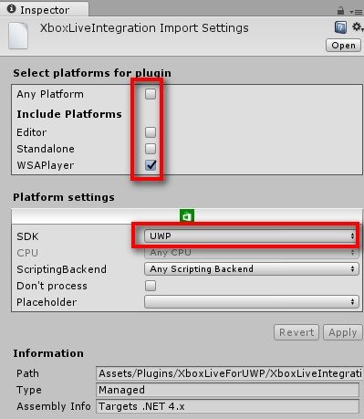
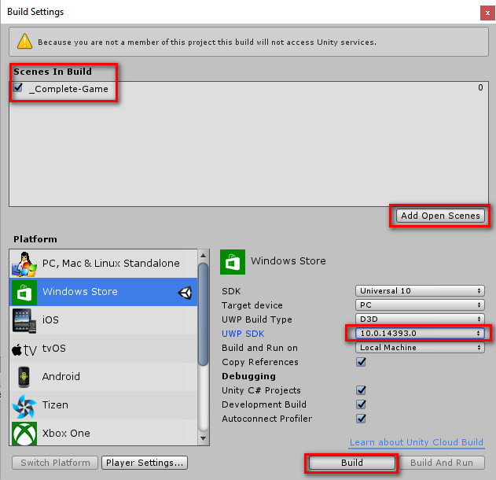
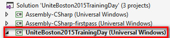
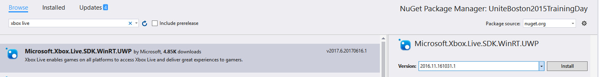
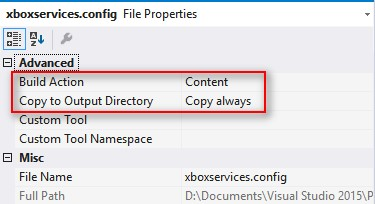

# UWPUnityShowcase

- UWP - Xbox Live Programming Guide
- Xbox-Live-Integration Class Library **(V1.0 01/04/2018)**
- UWP Sample
- Unity based UWP sample
- **Partner Unity UWP Sample Assets (2018 Jan Release)**

# [Partner Unity UWP Sample Assets](Assets/)

Firstly, please note that **the official Unity plugin for ID@Xbox developers** that linked to [here](https://docs.microsoft.com/en-us/windows/uwp/xbox-live/get-started-with-partner/partner-unity-uwp-il2cpp) in **Step 6**. 

The code logic of this sample assets is based on [xbox-live-unity-plugin](https://github.com/Microsoft/xbox-live-unity-plugin) to support [Creators Program](https://www.xbox.com/en-US/developers/creators-program/) and **[ID@XBOX Program Partner](https://www.xbox.com/en-US/developers/id)**. Most API surfaces are remained the same.

In this assets, we used [xbox-live-api](https://github.com/Microsoft/xbox-live-api) instead of the original Xbox Live libraries (e.g. Microsoft.Xbox.Services.UWP.CSharp.dll), so that we can use achievements and some other features that is not supported in Xbox Live Creators Program. However, as we used WinRT APIs, there will be no placeholder data when playing in the editor.

This sample assets is still under developing. For now, it only demonstrates SignIn and Profile, Stats, Leaderboards and Achievements. Developers can refer to this sample assets and develop your own implementation.

Check out the [Wiki](https://github.com/IDXboxChinaUWPShowcase/UWPUnityShowcase/wiki) for details

# UWP - Xbox Live Programming Guide

[Download pdf](Documents/UWP-Xbox_Live_Programming_Guide_20170415.pdf)

# Xbox-Live-Integration

.Net wrapper for Xbox Live SDK for UWP

## Xbox Live API structure

## XboxLiveIntegration(Class Library) [code map](Documents/XboxLiveIntegrationCodeMap.dgml)

---

## [About the UWP sample project](Samples/XboxUWPApp1)

Shows how to use XboxLiveIntegration lib to intergrate Xbox Live service with the UWP app

### Pre-coding Preparation

1. Apply ID@Xbox / Register UDC
2. Preparation on UDC
3. Preparation on XDP
4. Associate UDC product with the XDP title
5. Configuring your development PC (Sandbox Setup)

### Build the sample

1. If you download the samples ZIP, be sure to unzip the entire archive, not just the folder with the sample you want to build. 
2. Start Microsoft Visual Studio 2015 and select **File** \> **Open** \> **Project/Solution**.
3. Starting in the folder where you unzipped the samples, go to the Samples subfolder. Double-click the Visual Studio Solution (.sln) file.
4. There are three missing files

    
5. Double-click **Package.appxmanifest** file and navigate to **Packaging** page, click **Choose Certificate...** button
6. Click **Configure Certifacte...** -> **Create test Certificate** -> Fill password for test certificate -> Click OK button
    
7. Associate app with the Store

    From the Project menu in your Visual Studio solution, choose "Store > Associate App with the Store"

    See [Microsoft Doc](https://developer.microsoft.com/en-us/windows/holographic/submitting_an_app_to_the_windows_store#associate_app_with_the_store)
8. Edit the **xboxservices.config** JSON file, replace the `TitleId`, `PrimaryServiceConfigId` with the values you get from Windows Dev Center(UDC)
9. Rebuild the sample project and **ensure the `Microsoft.Xbox.Live.SDK.WinRT.UWP` (version 2016.11.161031.1) nuget package is installed**. Right-click XboxUWPApp1 project > Manage NuGet Packages... > Installed
    
10. **Select "x64" from the configuration dropdown in the toolbar of Visual Studio**.
11. Press Ctrl+Shift+B, or select **Build** \> **Build Solution**.

### Run the sample

The next steps depend on whether you just want to deploy the sample or you want to both deploy and run it.

- Deploying the sample

    - Select Build > Deploy Solution. 

- Deploying and running the sample

    - To debug the sample and then run it, press F5 or select Debug >  Start Debugging. To run the sample without debugging, press Ctrl+F5 or select Debug > Start Without Debugging. 

---

## About the Unity based UWP sample project

Shows how to use XboxLiveIntegration lib to intergrate Xbox Live service with the **Unity based UWP app**. This sample is based on the official Unity demo: [Tanks](https://unity3d.com/learn/tutorials/projects/tanks-tutorial).

Most of code changes are in the GameManager.cs file, Path: *Assets\_Completed-Assets\Scripts\Managers\GameManager.cs*

### Pre-coding Preparation

1. Apply ID@Xbox / Register UDC
2. Preparation on UDC
3. Preparation on XDP
4. Associate UDC product with the XDP title
5. Configuring your development PC (Sandbox Setup)

### Dev Environment

1. Unity 5.6.0f3 (64-bit)
2. VS2015 Update3
3. Windows 10 RS1

### Build the sample

1. Download the Tanks project: https://www.assetstore.unity3d.com/en/#!/content/46209/
2. Open the **_Complete-Game** scene in Unity Editor, replace the *Assets\_Completed-Assets\Scripts\Managers\GameManager.cs* file with *Samples\Tanks\GameManager.cs* file
3. In the Unity Editor, Open Assets/Plugins, drag Microsoft.Xbox.Services.winmd and **XboxLiveIntegration.dll** into to Assets hierarchy. Change Importing settings for **XboxLiveIntegration.dll**. Select this item and change setting as follows

    
4. File -> Build Settings -> change settings as below

    

    **Please notice that, for UWP SDK setting, if you choose the Latest installed option and the Windows version is RS2(15063), please ensure VS2017 is installed. Otherwise, please choose 10.0.14393.0**.
5. Start Microsoft Visual Studio 2015 and select **File** \> **Open** \> **Project/Solution**, choose the UWP project we just generated. We will see three porojects in this solution. the first two projects are auto-generated, we need to do some changes in the third UWP project:

    
6. Install XBL Nuget package for your UWP project. Search for "xbox live" in the "Manage NuGet Packages" page. Select the appropriate API set (C++ or WinRT), choose version **2016.11.161031.1** and then click on “Install”

    
7. Associate the UWP project with your Xbox Live enabled title information
    - Create a JSON file and name it xboxservices.config
    - Add the JSON file to your primary UWP project (the StartUp Project) 
    - Right click on the file, select Properties and ensure that Build Action is set to **Content** and set **Copy always** for **Copy to Output Directory**. This will ensure the file is copied correctly in the AppX folder.

        
    - Edit the JSON file with the following template, and replace the TitleId, PrimaryServiceConfigId with the values you get from Windows Dev Center(UDC)

        *{"TitleId": xxxxxx, "PrimaryServiceConfigId": "exxxx-7xxx-4xxx-axxx-3609xxx" }*
8. Associate publisher information with your UWP App
    - Open your project in Visual Studio 2015
    - Right click the primary UWP project (the StartUp Project), click **Store** -> **Associate App with the Store…**
    - Sign-in with the Windows Developer account used for creating the app if asked
    - On the next page, select the app you just created, confirm the information, and click **Associate**
9. Enable Internet (Client) capability
    - Double click on the **package.appxmanifest** file in Visual Studio 2015 to open the Manifest Designer. 
    - Click on the **Capabilities** tab 
    - Click on **Internet (Client)**
    - Close the file and save the changes
10. <del>Add Xbox Extensions for the UWP</del>
    - <del>Right-Click project, **Add** -> **Reference…**</del>
    - <del>Universal Windows -> Extensions -> Select **Xbox Extensions for the UWP**</del>
11. **Select "x64" from the configuration dropdown in the toolbar of Visual Studio**