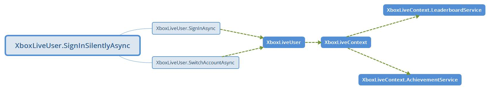
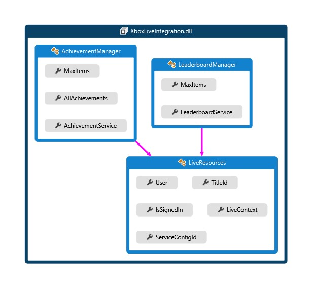
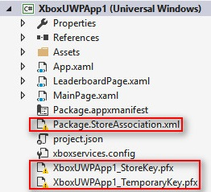
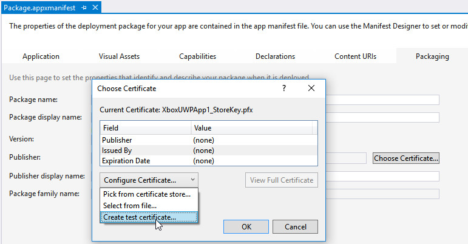
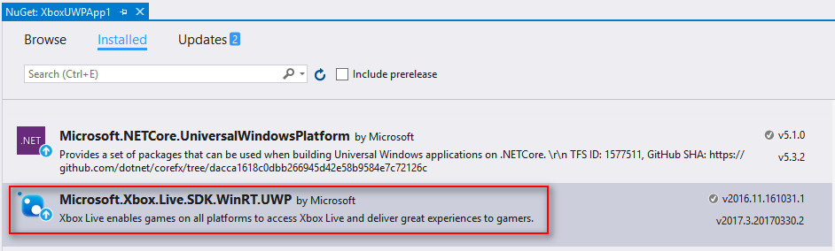

# UWPUnityShowcase
- Xbox-Live-Integration Class Library
- UWP - Xbox Live Programming Guide

# Xbox-Live-Integration

.Net wrapper for Xbox Live SDK for UWP

## Xbox Live API structure

## XboxLiveIntegration(Class Library) code map
[Code Map LINK](Documents/XboxLiveIntegrationCodeMap.dgml)

## About the sample project 

Shows how to use XboxLiveIntegration lib to intergrate Xbox Live service with the UWP app

### Pre-coding Preparation

1. Apply ID@Xbox / Register UDC
2. Preparation on UDC
3. Preparation on XDP
4. Associate UDC product with the XDP title
5. Configuring your development PC (Sandbox Setup)

### Build the sample

1. If you download the samples ZIP, be sure to unzip the entire archive, not just the folder with the sample you want to build. 
2. Start Microsoft Visual Studio 2015 and select **File** \> **Open** \> **Project/Solution**.
3. Starting in the folder where you unzipped the samples, go to the Samples subfolder. Double-click the Visual Studio Solution (.sln) file.
4. There are three missing files

    
5. Double-click **Package.appxmanifest** file and navigate to **Packaging** page, click **Choose Certificate...** button
6. Click **Configure Certifacte...** -> **Create test Certificate** -> Fill password for test certificate -> Click OK button
    
7. Associate app with the Store

    From the Project menu in your Visual Studio solution, choose "Store > Associate App with the Store"

    See [Microsoft Doc](https://developer.microsoft.com/en-us/windows/holographic/submitting_an_app_to_the_windows_store#associate_app_with_the_store)
8. Edit the **xboxservices.config** JSON file, replace the `TitleId`, `PrimaryServiceConfigId` with the values you get from Windows Dev Center(UDC)
9. Rebuild the sample project and **ensure the `Microsoft.Xbox.Live.SDK.WinRT.UWP` (version 2016.11.161031.1) nuget package is installed**. Right-click XboxUWPApp1 project > Manage NuGet Packages... > Installed
    
10. **Select "x64" from the configuration dropdown in the toolbar in Visual Studio**.
11. Press Ctrl+Shift+B, or select **Build** \> **Build Solution**.

### Run the sample

The next steps depend on whether you just want to deploy the sample or you want to both deploy and run it.

- Deploying the sample

    - Select Build > Deploy Solution. 

- Deploying and running the sample

    - To debug the sample and then run it, press F5 or select Debug >  Start Debugging. To run the sample without debugging, press Ctrl+F5 or select Debug > Start Without Debugging. 
